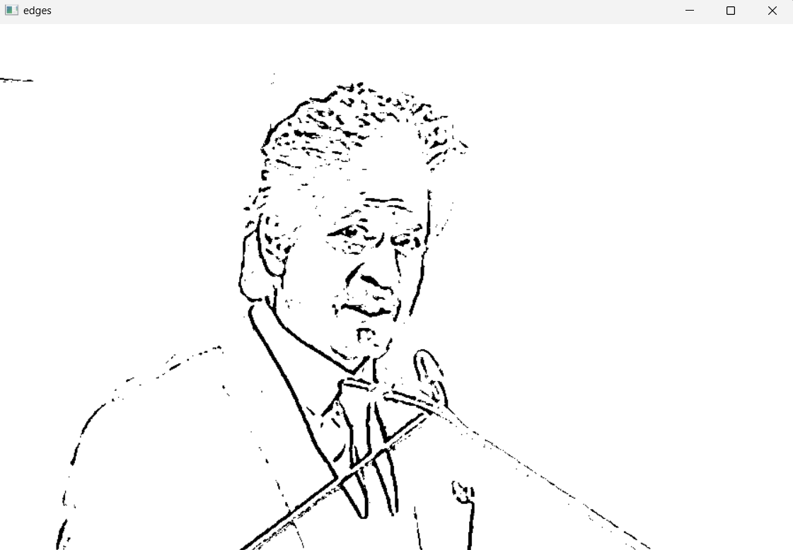
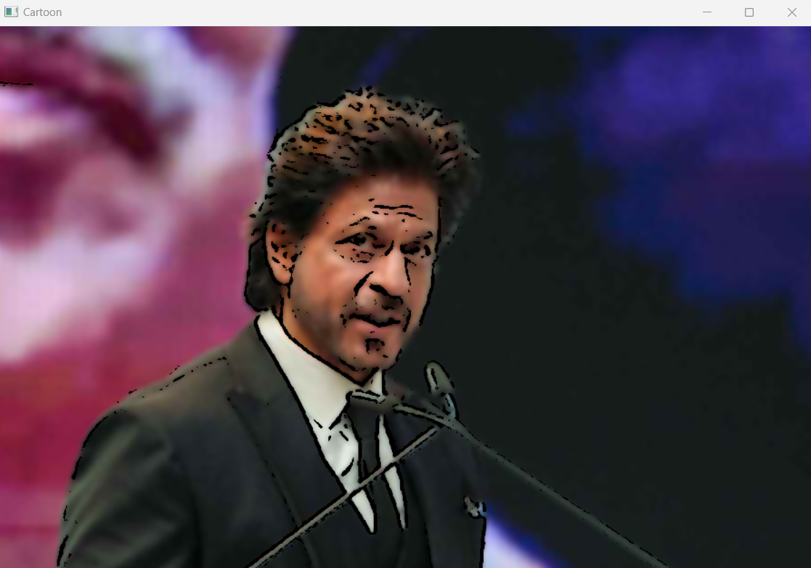

# TOON-MAGIC!
# Project Description: Image to Cartoon Converter

Description:
This project is an image processing tool that transforms regular photographs into cartoon-like images using computer vision techniques. The goal is to provide a fun and engaging way for users to convert their favorite photos into stylized cartoon images, giving them a unique and artistic flair.

# Overview

The project utilizes the OpenCV library in Python to apply a series of image processing steps that mimic the appearance of hand-drawn cartoons. The core process involves edge detection, color smoothing, and blending techniques that collectively create the desired cartoon effect.

# Features:

- **Simple to Use:** Users only need to provide an input image, and the program will automatically convert it into a cartoon-like image.
- **Real-Time Visualization:** The tool provides immediate visual feedback, displaying both the detected edges and the final cartoon image.
- **Customizable Parameters:** Users can tweak parameters like the bilateral filter's intensity or the adaptive threshold settings to fine-tune the cartoon effect.

# Applications:

- **Social Media Content Creation:** Users can create unique and engaging content for social media platforms.
- **Digital Art and Illustration:** Artists and designers can use the tool to create cartoon versions of their photographs for digital art projects.
- **Educational Purposes:** Teachers and educators can use cartoonized images for fun and interactive learning materials.

# Conclusion:

This is a fun, easy-to-use tool for converting images into cartoon-like illustrations. By leveraging powerful image processing techniques in OpenCV, this project brings creativity and art to everyday photos, making it an enjoyable experience for users of all ages.

ORGINAL IMAGE:

OUTPUT IMAGE:

OUTPUT IMAGE:

